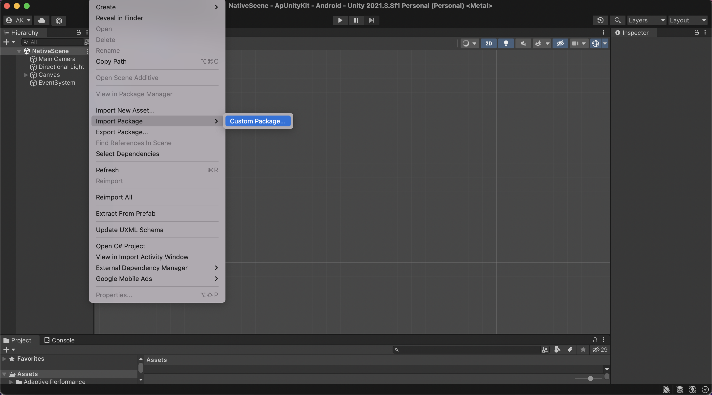
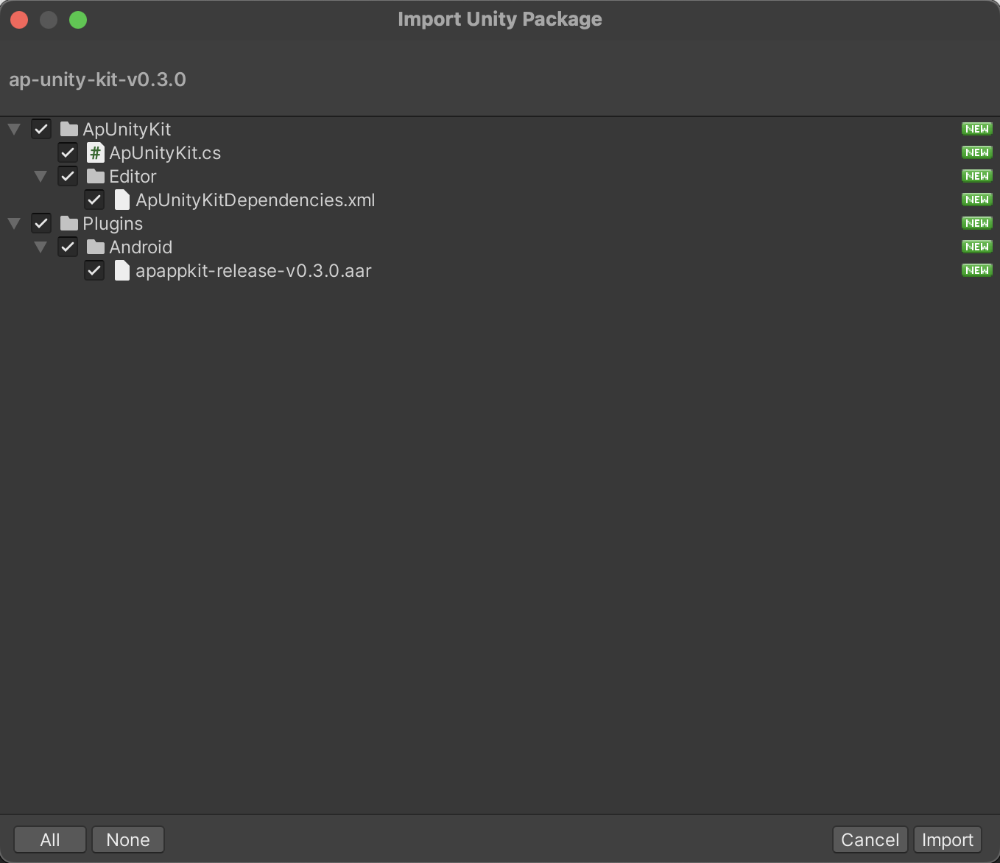
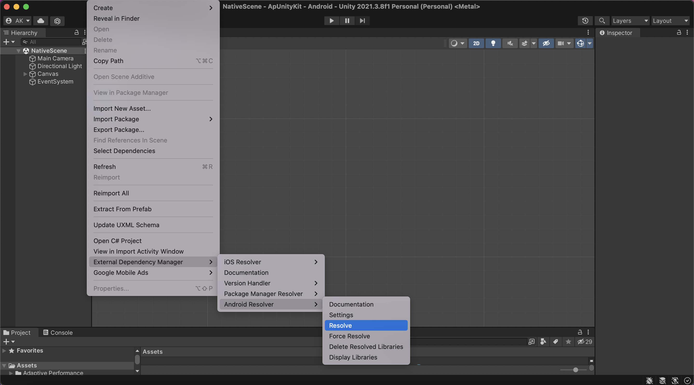
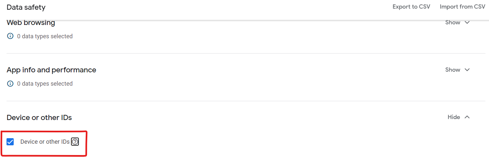

# Ap Unity Kit - Quick Guide

## Get Started:

This guide is intended for publishers who want to monetize their Android apps/games built using Unity with AdPushup AdX ads. Integrating the Ap Unity Kit into an app is the first step toward implementing AdPushUp AdX Ads in your app.

## Implementation Steps:

### A: **Download the Ap Unity Kit plugin**:

Use the links below to download the Unity package for the plugin or to take a look at its code on GitHub.

- [View Source](https://github.com/adpushup/ApUnityKit)

### B: **Import the Ap Unity Kit plugin:**

<aside>
💡 It is advisable to add the **Google Mobile Ads Unity plugin** before adding Ap Unity Kit. Ap Unity Kit uses the **[Unity Play Services Resolver library](https://github.com/googlesamples/unity-jar-resolver)** which is distributed with the Google Mobile Ads Unity plugin.

</aside>

1. Open your project in the Unity editor. Select **Assets > Import Package > Custom Package** and find the `ApUnityKit.unitypackage` file you downloaded.
    
    
    
2. Make sure all of the files are selected and click **Import.**
    
    
    
3. In the Unity editor, select **Assets > External Dependency Manager > Android Resolver > Resolve**. The Unity External Dependency Manager library will copy the declared dependencies into the `Assets/Plugins/Android` directory of your Unity app.
    
    
    

### C: Usage:

```csharp
// Your Google Ads Events Callback Functions
private void HandleOnAdClosed(object sender, EventArgs e)
{
		ApUnityKit.PingAdClosed(adUnitId, rewardedAd.GetResponseInfo().GetResponseId());
}

private void HandleOnAdOpened(object sender, EventArgs e)
{
    ApUnityKit.PingAdOpened(adUnitId, rewardedAd.GetResponseInfo().GetResponseId());
}

private void HandleOnAdLoaded(object sender, EventArgs e)
{
    ApUnityKit.PingAdLoaded(adUnitId, rewardedAd.GetResponseInfo().GetResponseId());
}

private void HandleAdImpression(object sender, EventArgs e)
{
    ApUnityKit.PingAdImpression(adUnitId, nativeAd.GetResponseInfo().GetResponseId());
}
// ...
```

## Data Collected By ApReactKit:

<aside>
🛡️ **Note:** We collect this data solely for the purpose of fraud detection and security purposes. We encrypt this data before sending it to our servers to prevent any data breaches and MITM Attacks. AdPushup always respects user privacy and takes all the measures to secure user data. No user data is shared with anyone. Please refer to the Privacy Policy Doc of AdPushup ApAppKit for further information.

</aside>

1. **Basic Device Data:**
    1. Device Manufacturer, Brand, Model, OS Version.
    2. Root Status, Emulator Status, and Play Services Installed Status.
2. **Ad Responses:**
    1. Ad Response ID
    2. Ad Unit ID
3. **Device Ids, Session IDs, and Fingerprints:**
    1. ApAppKit uses Fingerprint JS **(GDPR/CCPA Compliant).**

### **You must declare this data collection on Play Store Data Safety Declarations as well as in your Privacy Policy.**

### Play Store Declaration:

While filling up the Data Safety Form for your app, You should do the following three declarations.

1. Tick on **Device or other IDs**.



1. Check **Shared Checkbox** in the ‘*Is this data collected, shared, or both?’* field.


1. Check the **Fraud prevention, security, and compliance Checkbox** in the ‘*Why is this user data shared? Select all that apply.*’ field.


That’s all… You are good to go…